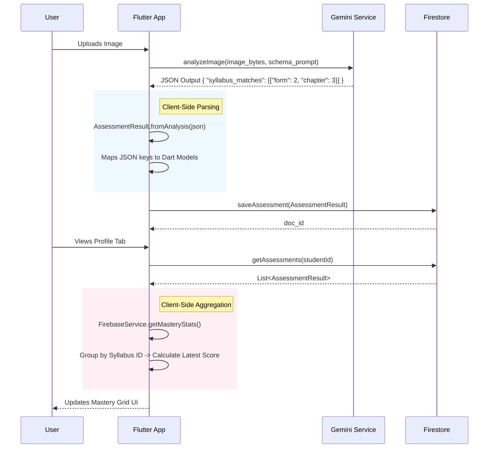

# Technical Implementation: AI-to-Database Progress Tracking

This document details how the Punca AI application bridges the gap between unstructured image data (student work) and structured progress tracking (database mastery) without a dedicated backend server.

## Architecture Overview

The "Backend" logic runs client-side within the Flutter application, coordinating two external services:
1.  **AI Analysis (Gemini 1.5 Pro)**: Extracts structured data from images.
2.  **Database (Firebase Firestore)**: Persists the structured data and aggregates it for reporting.



## Step-by-Step Implementation

### Step 1: Prompt Engineering (The Interface)
The standard interface between the AI and our Code is the **JSON Schema** defined in the prompt.
*   **File**: `lib/core/services/gemini_service.dart`
*   **Critical Instruction**: We explicitly instruct Gemini to map its findings to the official KSSM Syllabus structure.

```dart
// The Prompt enforces this structure
"syllabus_matches": [
  {
    "form": 2, 
    "chapter": 3, 
    "confidence": 0.95
  }
]
```
This ensures that "Algebraic Expressions" is always identified as `Form 2, Chapter 3`, regardless of how the student writes it.

### Step 2: Data Modeling (The Translator)
When the JSON returns, we parse it into strong Dart objects.
*   **File**: `lib/core/models/assessment_model.dart`
*   **Class**: `AssessmentResult` & `SyllabusPointer`

```dart
// Parsing logic
factory AssessmentResult.fromAnalysis(...) {
  return AssessmentResult(
    // ...
    syllabusIds: (json['syllabus_matches'] as List)
        .map((e) => SyllabusPointer.fromJson(e)) // {"form":2, "chapter":3}
        .toList(),
  );
}
```

### Step 3: Persistence (The Storage)
We save the raw assessment result, *including* the syllabus IDs, to Firestore. available for future querying.
*   **File**: `lib/core/services/firebase_service.dart`
*   **Method**: `saveAssessment()`
*   **Collection**: `assessments/{docId}`

### Step 4: Aggregation (The Logic)
This is where the "Update" happens. We don't increment a counter in the DB; instead, we re-calculate the state of the world based on the latest evidence.
*   **File**: `lib/core/services/firebase_service.dart`
*   **Method**: `getMasteryStats()`

**Logic Flow:**
1.  Fetch all assessments for the student.
2.  Iterate through them.
3.  For each assessment, look at `syllabusIds`.
4.  Construct a **Deterministic Key**: `F{form} C{chapter}` (e.g., `F2 C03`).
5.  Group scores by this Key.
6.  **Rule**: Take the *Latest* score (based on `createdAt`).

```dart
// Simplified Logic
keyScores[key] = []; // e.g. "F2 C03": [80, 40] (80 is latest)
mastery[key] = keyScores[key].first; // Current Mastery = 80%
```

### Step 5: Visualization (The Feedback)
The UI simply renders the computed map.
*   **File**: `lib/features/student/profile/widgets/mastery_grid.dart`
*   **Widget**: `MasteryGrid`

It receives `Map<String, double?>` (e.g., `{"F2 C03": 0.8}`) and renders the battery bar accordingly.

## Why this approach?
*   **Robustness**: If we change the logic (e.g., "Latest" vs "Average"), we just update the code, and it applies to *all past data* instantly. We don't need to run database migrations.
*   **Simplicity**: No backend server to maintain.
*   **Accuracy**: Relies on specific IDs (Form/Chapter) rather than fuzzy string matching.
